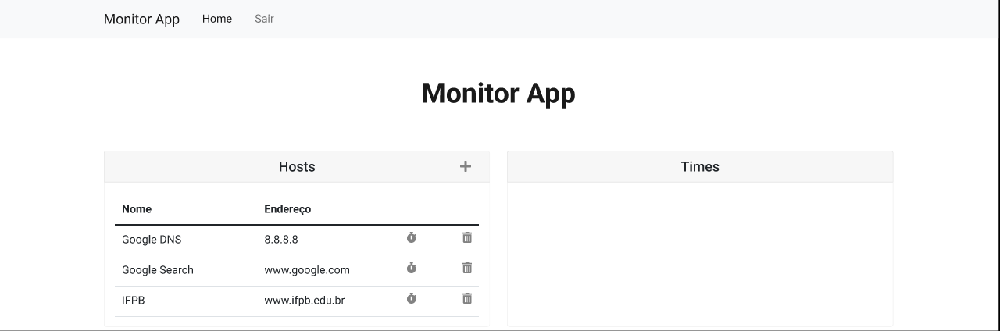

# Monitor App

O projeto Monitor App consiste em uma aplicação Web para monitorar a disponibilidade e latência de host cadastrados sistema.

## Protótipo

As telas do projeto estão disponíveis [neste projeto](https://figma.com/file/3rWtag6oLh0amk2wS0XQH1/monitor-app) do Figma.
